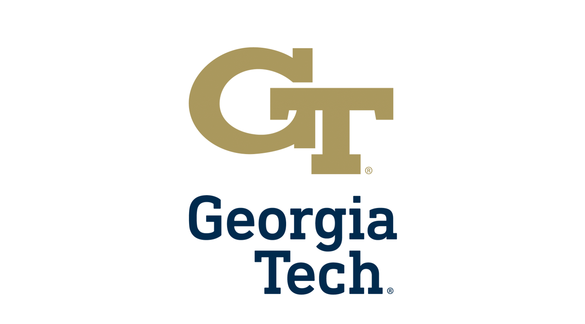

  
  
👋 Hi there! I'm <strong>Md Asif Bin Syed</strong>, a <em>Sr. Supply Chain Data Analyst</em> at <strong>The Home Depot</strong>, the world's leading home improvement retailer. Leading the development of offline <strong>reinforcement learning</strong> agents that reduce delivery failures by 4.5% ($6.5M retained revenue) and building ML Model for operational forecasting.

 
I am a researcher specializing in **reinforcement learning**, **generative AI**, and **deep learning** across domains such as marine surveillance, medical diagnosis, supply chain optimization, and time series forecasting.
I have published in venues including **ICML Workshop'25**, **NeurIPS Workshop'25**, **IEEE conferences**, with contributions in time series foundation models, diversity quantification, and physics-informed neural networks.  

  

    

      
      ICML
    

    

      
      NeurIPS
    

    

      
      WVU
    

    

      
      Georgia Tech
    

    

      
      SUST
    

    

      
      Volvo
    

    

      
      Home Depot
    

  

<blockquote style="margin-left: 3.5em;">
    
2025 - 

    
   Working in <a href="https://www.homedepot.com" style="color: blue;">The Home Depot</a> leveraging machine learning and reinforcement learning to optimize our delivery network - using predictive models to forecast delivery times, route optimization algorithms to determine the most efficient delivery paths, and reinforcement learning to dynamically adjust delivery schedules based on real-time conditions.
 
2024 - 

</blockquote>

<blockquote style="margin-left: 3.5em;">
    
  leverage machine learning in <a href="https://www.homedepot.com" style="color: blue;">Volvo</a>  to optimize the  load for carrier  and forecasting the demand for inboud deliveries
 
2023 - 

</blockquote>

<main markdown="1">

<h2 id="publications">📄 Publications</h2>

I have published and presented my work at prestigious conferences and journals, including Journal of Marine Science and Engineering, Sensors, IEEE conferences, and IISE, as well as workshops at various international venues.

 <strong>Zero-Shot Time-Series Forecasting: Do Time-Series FMs Outperform Domain-Agnostic FMs?</strong> · <em><strong>Syed, M. A. B.</strong>, et al. (2025)</em> · <strong>NeurIPS 2025 Workshop (BERT²S)</strong> · <a class="bracket-link" href="https://openreview.net/forum?id=HvbMOFV9zZ">OpenReview</a> · NeurIPS Deep Learning Time Series Foundation Models 
<a href="#" class="abstract-toggle" onclick="toggleAbstract(event, 'abstract6')">Show Abstract</a>

<strong>Abstract:</strong> Foundation models (FMs) have achieved major advances in language, vision, and speech. In parallel, time-series foundation models (TSFMs) have been developed to address forecasting tasks. A key question is whether TSFMs truly generalize to unseen time series data, and whether they perform better than general-purpose FMs from other domains in a zero-shot setting. We compare four TSFMs such as Chronos, Times-FM, TimeGPT, and MOMENTs with cross-domain FMs for text (GPT), audio (Whisper), and vision (ViT). For a systematic comparison, we use simple task-agnostic adapters to convert sequences into forecasts, without fine-tuning or changing the backbone models. All models are evaluated on nine diverse datasets that were unseen during training. Our results show that TSFMs perform best on most datasets, highlighting the benefit of temporal pretraining and time-aware design. Overall, the strong zero-shot performance of TSFMs suggests that they may represent a breakthrough comparable to BERT for time series forecasting. At the same time, large text-based models such as GPT remain surprisingly competitive, in some cases even surpassing TSFMs, highlighting the ability of general-purpose models to capture temporal patterns despite not being trained for this task. GitHub repository: https://github.com/anonymous4865/tsfms.

 <strong>Advancing Marine Surveillance: A Hybrid Approach of Physics Infused Neural Network for Enhanced Vessel Tracking Using Automatic Identification System Data</strong> · <em>Haque, T., <strong>Syed, M. A. B.</strong>, Das, S., &amp; Ahmed, I. (2024)</em> · <strong>Journal of Marine Science and Engineering, 12(11), 1913</strong> · <a class="bracket-link" href="https://doi.org/10.3390/jmse12111913">DOI</a> · Marine AI Deep Learning Physics-Informed 
<a href="#" class="abstract-toggle" onclick="toggleAbstract(event, 'abstract1')">Show Abstract</a>

<strong>Abstract:</strong> This paper presents a novel hybrid approach combining physics-informed neural networks with automatic identification system (AIS) data for enhanced vessel tracking in marine surveillance applications. Our methodology integrates domain knowledge from maritime physics with deep learning techniques to improve tracking accuracy and robustness. The proposed framework addresses key challenges in vessel trajectory prediction and association, demonstrating significant improvements over traditional methods through extensive experimental validation on real-world AIS datasets.

 <strong>Federated Learning in Manufacturing: A Systematic Review and Pathway to Industry 5.0</strong> · <em><strong>Syed, M. A. B.</strong>, Rhaman, Q., &amp; Sushil, S. (2023)</em> · <strong>IEEE STI 2023</strong> · <a class="bracket-link" href="https://ieeexplore.ieee.org/abstract/document/10464397">DOI</a> · Federated Learning Manufacturing Industry 5.0 
<a href="#" class="abstract-toggle" onclick="toggleAbstract(event, 'abstract2')">Show Abstract</a>

<strong>Abstract:</strong> This systematic review explores the application of federated learning in manufacturing environments, examining its potential to enable Industry 5.0 transformation. We analyze current research trends, identify key challenges in distributed learning for industrial settings, and propose a comprehensive framework for implementing federated learning systems in manufacturing. Our analysis covers privacy-preserving machine learning, edge computing integration, and collaborative model training across multiple manufacturing facilities.

 <strong>A CNN-LSTM Architecture for Marine Vessel Track Association Using Automatic Identification System (AIS) Data</strong> · <em><strong>Syed, M. A. B.</strong>, &amp; Ahmed, I. (2023)</em> · <strong>Sensors, 23(14), 6400</strong> · <a class="bracket-link" href="https://doi.org/10.3390/s23146400">DOI</a> · Marine AI Deep Learning Track Association 
<a href="#" class="abstract-toggle" onclick="toggleAbstract(event, 'abstract3')">Show Abstract</a>

<strong>Abstract:</strong> We propose a hybrid CNN-LSTM architecture for solving the track association problem in marine surveillance using AIS data. The model combines convolutional neural networks for spatial feature extraction with long short-term memory networks for temporal sequence modeling. Our approach effectively handles the challenges of vessel trajectory prediction and association in complex maritime environments, achieving superior performance compared to traditional methods on large-scale AIS datasets.

 <strong>Investigation of Polycystic Ovary Syndrome (PCOS) Diagnosis Using Machine Learning Approaches</strong> · <em>Habib, A. Z. S. B., <strong>Syed, M. A. B.</strong>, Islam, M. E., &amp; Tasnim, T. (2023)</em> · <strong>IEEE STI 2023</strong> · <a class="bracket-link" href="https://ieeexplore.ieee.org/abstract/document/10465079">DOI</a> · Medical AI Deep Learning Diagnosis 
<a href="#" class="abstract-toggle" onclick="toggleAbstract(event, 'abstract4')">Show Abstract</a>

<strong>Abstract:</strong> This study investigates the application of machine learning techniques for diagnosing Polycystic Ovary Syndrome (PCOS), a common endocrine disorder affecting women. We evaluate multiple machine learning algorithms including support vector machines, random forests, and deep neural networks using clinical and biochemical parameters. Our results demonstrate the potential of ML-based diagnostic systems to assist healthcare professionals in early detection and accurate diagnosis of PCOS, potentially improving patient outcomes through timely intervention.

 <strong>Understanding AI Chatbot Adoption in Education: PLS-SEM Analysis of User Behavior Factors</strong> · <em>Hasan, M. R., Chowdhury, N. I., Rahman, M. H., <strong>Syed, M. A. B.</strong>, &amp; Ryu, J. (2023)</em> · <strong>Journal of Computers in Human Behavior: Artificial Humans</strong> · <a class="bracket-link" href="https://www.sciencedirect.com/science/article/pii/S2949882124000586">DOI</a> · NLP Education PLS-SEM 
<a href="#" class="abstract-toggle" onclick="toggleAbstract(event, 'abstract5')">Show Abstract</a>

<strong>Abstract:</strong> This research employs Partial Least Squares Structural Equation Modeling (PLS-SEM) to investigate the factors influencing AI chatbot adoption in educational settings. We examine user behavior patterns, technology acceptance factors, and educational outcomes associated with chatbot implementation. Our findings reveal key determinants of adoption including perceived usefulness, ease of use, and educational value, providing insights for educators and technology developers seeking to enhance learning experiences through AI-powered conversational interfaces.

<a href="publications" class="btn btn-primary">View All Publications →</a>

<h2 id="technical-skills">Technical Skills</h2>

<ul class="skills-list">
  <li><strong>Programming Languages:</strong> Python, R, SQL, C</li>
  <li><strong>ML/DL Frameworks:</strong> Scikit-learn, Keras, TensorFlow, PyTorch</li>
  <li><strong>Data Analysis:</strong> MS Excel, Tableau, Power BI, Minitab</li>
  <li><strong>Cloud Platforms:</strong> AWS, Azure ML, GCP, Vertex AI</li>
  <li><strong>MLOps & DevOps:</strong> Docker, Kubernetes, Jenkins, Git, GitHub Actions, MLflow, DVC, Weights & Biases</li>
  <li><strong>Databases:</strong> BigQuery, MySQL, PostgreSQL</li>
  <li><strong>Model Deployment:</strong> FastAPI, Flask, TensorFlow Serving, Model Monitoring, A/B Testing, CI/CD Pipelines</li>
  <li><strong>Other Tools:</strong> SAP Ariba, SAP MDCS, SolidWorks, MS Project, MS Access, CPLEX, HTML, CSS</li>
</ul>

<h2 id="whats-new" class="news-heading">📰 News and Updates</h2>

  <ul>
    <li>
      Nov 2024:
      Promoted to Sr. data analyst in supply chain at The Home Depot
    </li>
    <li>
      Oct 2024:
      Published a journal in Journal of Marine Science and Engineering: 
        <a href="https://www.mdpi.com/2077-1312/12/11/1913"><b>"Advancing Marine Surveillance: A Hybrid Approach of Physics Infused Neural Network for Enhanced Vessel Tracking Using Automatic Identification System Data."</b></a>
      
    </li>
    <li>
      Oct 2024:
      Awarded my first associate of the month by The Home Depot for discovering an opportunity to save around 2 M dollars by reducing extra pallets required
    </li>
    <li>
      Aug 2024:
      Published a journal in Journal of Computers in Human Behavior: Artificial Humans 
        <a href="https://www.sciencedirect.com/science/article/pii/S2949882124000586"><b>"Understanding AI Chatbot Adoption in Education: PLS-SEM Analysis of User Behavior Factors."</b></a>
      
    </li>
    <li>
      Jan 2024:
      Started my full-time position as a Data Analyst in supply chain at The Home Depot
    </li>
    <li>
      Dec 2023:
      Presented a paper on 
        <a href="https://ieeexplore.ieee.org/abstract/document/10465079"><b>"Investigation of Polycystic Ovary Syndrome (PCOS) Diagnosis Using Machine Learning Approaches"</b></a> 
        and 
        <a href="https://ieeexplore.ieee.org/abstract/document/10441152"><b>"A Deep Learning Approach for Satellite and Debris Detection: YOLO in Action"</b></a> 
        at the 2023 5th International Conference on Sustainable Technologies for Industry 5.0 (STI).
      
    </li>
    <li>
      Dec 2023:
      Presented a paper on 
        <a href="https://ieeexplore.ieee.org/abstract/document/10441258"><b>"Pediatric Bone Age Prediction Using Deep Learning"</b></a> 
        and 
        <a href="https://ieeexplore.ieee.org/abstract/document/10464397"><b>"Federated Learning in Manufacturing: A Systematic Review and Pathway to Industry 5.0"</b></a> 
        at the 2023 26th International Conference on Computer and Information Technology (ICCIT).
      
    </li>
    <li>
      Dec 2023:
      Completed my Master's in Industrial Engineering and submitted my thesis on  
        <a href="https://researchrepository.wvu.edu/cgi/viewcontent.cgi?article=12915&context=etd"><b>"Spatio-Temporal Deep Learning Approaches for Addressing Track Association Problem Using Automatic Identification System (AIS) Data"</b></a>
      
    </li>
    <li>
      July 2023:
      Awarded "Idea of the Month" at Volvo Trucks for implementing Power Automate and AI to extract invoice data, saving $200 K.
    </li>
    <li>
      July 2023:
      Published a journal in MDPI Sensors: 
        <a href="https://www.mdpi.com/1424-8220/23/14/6400"><b>"A CNN-LSTM Architecture for Marine Vessel Track Association Using AIS Data."</b></a>
      
    </li>
    <li>
      May 2023:
      Finalist in the QCRE Data Challenge for 
        <a href="https://arxiv.org/pdf/2309.13402.pdf"><b>"ML Algorithm Synthesizing Domain Knowledge for Fungal Spore Concentration Prediction."</b></a>
      
    </li>
    <li>
      April 2023:
      Submitted a paper to the IISE conference on 
        <a href="https://arxiv.org/abs/2304.01491"><b>"Multi-Model LSTM Architecture for Track Association Using AIS Data."</b></a>
      
    </li>
    <li>
      October 2022:
      Chaired a session at the INFORMS Annual Meeting on 
        <a href="https://meetings.informs.org/wordpress/indianapolis2022/"><b>"Advanced Machine Learning."</b></a>
      
    </li>
  </ul>

<blockquote style="border-left: 4px solid #000080; padding-left: 15px;">
  

    Consistency is the key to self-improvement, and my GitHub activity serves as a powerful reminder of my commitment to continuous learning and coding progress.
  

</blockquote>

</main>
